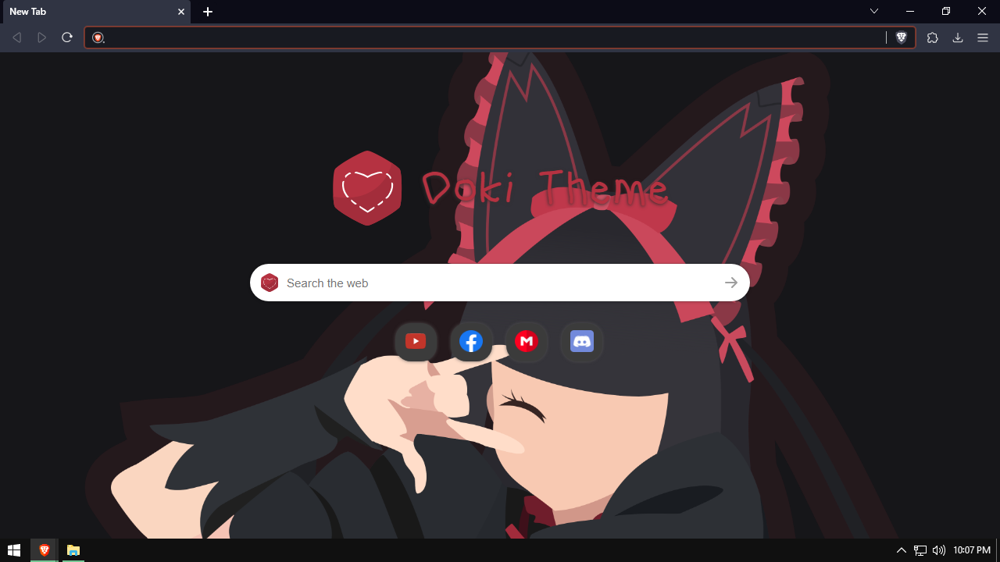

# Doki-doki WEB Improved 

<h3 style="font-family: monospace">Note</h3>
<dd>( This Theme Only Support Brave Browser )</dd>

<li> This Project Was Forked Based In <a href="https://github.com/doki-theme/doki-theme-web" style="text-decoration: none">Doki Theme Web</a></li>
  <li>The Fonts Of This Projects Is Not Also Mine So... Here The <a href="https://www.dafont.com/kindergarten-4.font">Sources</a> And Credits To Them.
<li> All Of This Code Was Made By Them, And This Version Was My Own Personal Modification. But Interested Then Try It!!</li><li>BTW Try The Original Version It Has A Lot Othere Anime Characters Than This.</li>

 
<h4>Screenshot:</h4>
</img>
 

<h2>Please Support My <a style="float: right; padding: 4px; text-decoration: none" href="https://www.youtube.com/channel/UCnMHIY-XZFMR1IRUiA0QQ9g"> Channel! :)</a></h2>

